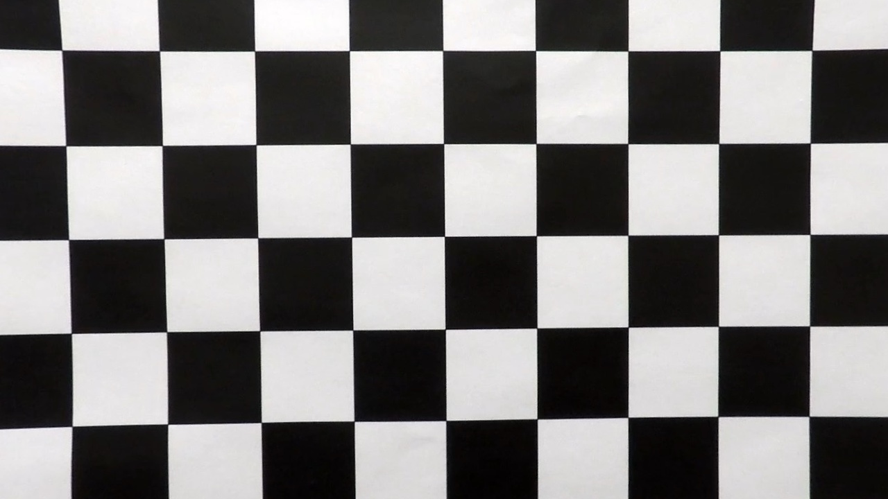
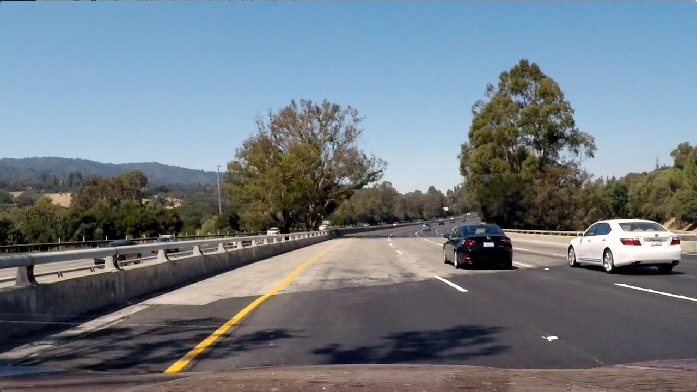
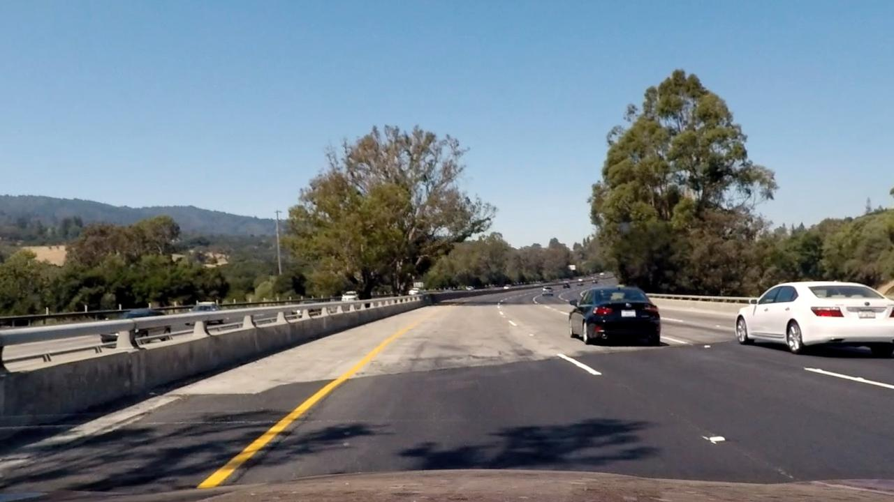
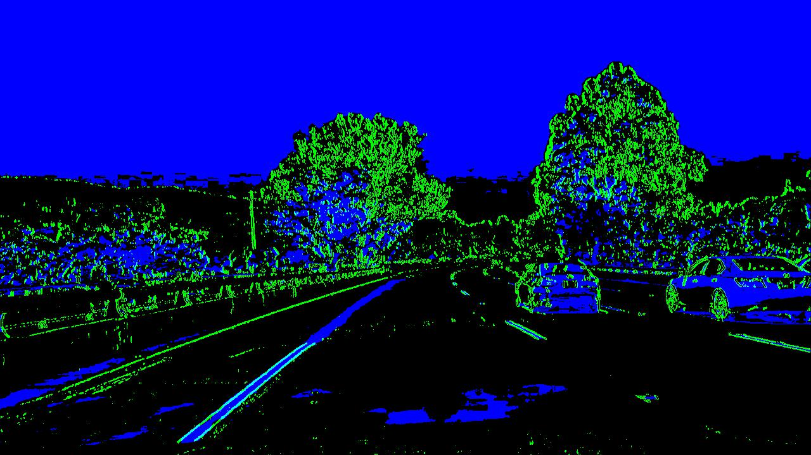
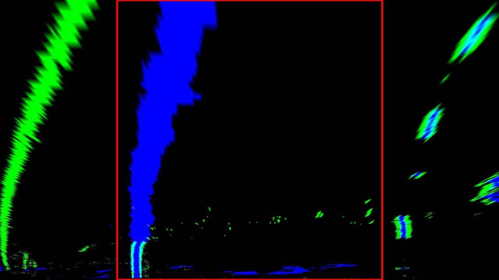
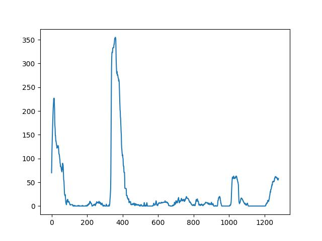
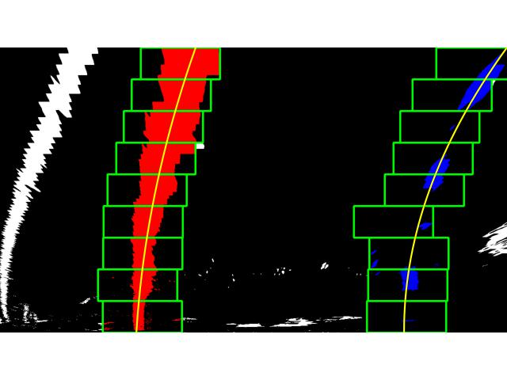
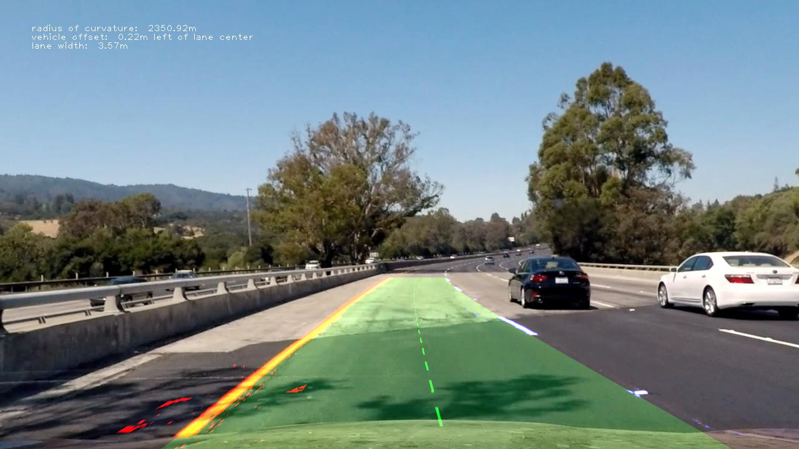

# Advanced Lane Finding - Evan Rosson

The goals / steps of this project are the following:

* Compute the camera calibration matrix and distortion coefficients given a set of chessboard images.
* Apply a distortion correction to raw images.
* Use color transforms, gradients, etc., to create a thresholded binary image.
* Apply a perspective transform to rectify binary image ("birds-eye view").
* Detect lane pixels and fit to find the lane boundary.
* Determine the curvature of the lane and vehicle position with respect to center.
* Warp the detected lane boundaries back onto the original image.
* Output visual display of the lane boundaries and numerical estimation of lane curvature and vehicle position.

## [Rubric](https://review.udacity.com/#!/rubrics/571/view) Points

### Here I will consider the rubric points individually and describe how I addressed each point in my implementation.  

---

### Writeup / README

#### 1. Provide a Writeup / README that includes all the rubric points and how you addressed each one.

Read on!

Note that instead of stating line numbers in the writeup below, I include links to the relevant parts of my code.

### Camera Calibration

#### 1. Briefly state how you computed the camera matrix and distortion coefficients. Provide an example of a distortion corrected calibration image.

My project performs all camera calibration in [`p2/calibrate.py`, in the `calibrate()` and `_find_chessboard_corners()` functions](https://github.com/erosson/CarND-Advanced-Lane-Lines/blob/master/p2/calibrate.py#L11-L52).

Camera calibration sets up a mapping between **object points** - coordinates in the three-dimensional real world, and **image points** - coordinates in two-dimensional images taken by our camera.
Image points are found by running `findChessboardCorners()` on a set of chessboard images.
Object points are easily constructed: they have predictible x and y coordinates (the distance between each corner is 1), z is zero (the chessboard is flat), and they are identical for every set of image points (our chessboard does not move).

`cv2.calibrateCamera()` then outputs camera calibration data.
I use this to `cv2.undistort()` the calibration images, to verify calibration worked correctly - see below.
Camera calibration data is also stored to a `calibration.pickle` file:
this allows skipping camera calibration for faster program startup after its first run.

*An unmodified image, with obvious distortion.*

*The same image, with distortion removed. Camera calibration makes a visible difference!*

---

### Pipeline (single images)

My program visualizes each step in its pipeline, including each image below, using the `view` parameter of [the `main()` function](https://github.com/erosson/CarND-Advanced-Lane-Lines/blob/master/p2/main.py#L134-L156).
An example is shown in [`P2.ipynb`](https://github.com/erosson/CarND-Advanced-Lane-Lines/blob/master/P2.ipynb).
The list of possible views is in [the `View` enum in `view.py`](https://github.com/erosson/CarND-Advanced-Lane-Lines/blob/master/p2/view.py#L12-L29).

(The `view` parameter also works for videos, but rendering a video for a long list of views will take a while.)

#### 1. Provide an example of a distortion-corrected image.

Camera calibration data - the output of `calibrate.py` - is passed throughout most of my program as [the `Calibration` datatype](https://github.com/erosson/CarND-Advanced-Lane-Lines/blob/master/p2/calibrate.py#L8).

The first step of my image pipeline [undistorts the image](https://github.com/erosson/CarND-Advanced-Lane-Lines/blob/master/p2/model.py#L223) using this camera calibration data.
[My `calibrate.undistort()`](https://github.com/erosson/CarND-Advanced-Lane-Lines/blob/master/p2/calibrate.py#L85) unwraps the Calibration datatype and performs the `cv2.undistort()` call.

*An unmodified image. Distortion is most visible at the bottom corners.*

*The same image, distortion-corrected.*

#### 2. Describe how (and identify where in your code) you used color transforms, gradients or other methods to create a thresholded binary image.  Provide an example of a binary image result.

After undistorting the original image, I apply [Sobel x-axis gradients and HLS saturation channel thresholds](https://github.com/erosson/CarND-Advanced-Lane-Lines/blob/master/p2/model.py#L32-L52)
as the [next step in my image pipeline](https://github.com/erosson/CarND-Advanced-Lane-Lines/blob/master/p2/model.py#L225-L230).
This creates a thresholded binary image useful for later calculations.

*A thresholded binary image, visualized using green as Sobel-X and blue as saturation.*

#### 3. Describe how (and identify where in your code) you performed a perspective transform and provide an example of a transformed image.

[My `perspective_transform()` function](https://github.com/erosson/CarND-Advanced-Lane-Lines/blob/master/p2/model.py#L55-L86) calculates the perspective transform points and matrices.
Source and destination points for this transform are constructed using a combination of the image size, and several image size percentages passed as parameters.
These percentage parameters allowed me to more easily experiment with slightly different perspective points.
The default parameters I settled on, plus [the `perspective_transform()` code](https://github.com/erosson/CarND-Advanced-Lane-Lines/blob/master/p2/model.py#L55-L86), results in the following source an destination points:

| Source        | Destination   | 
|:-------------:|:-------------:| 
| 200, 719      | 300, 719
| 1120, 719     | 980, 719
| 680, 445      | 980, 0
| 600, 445      | 300, 0

The following perspective-warped images verify that this perspective transform is reasonably accurate:

*The original, non-perspective-warped image.*

*The perspective-warped, birds-eye-view image. The lines here roughly match what we'd expect from the original.*

#### 4. Describe how (and identify where in your code) you identified lane-line pixels and fit their positions with a polynomial?

# TODO

Then I did some other stuff and fit my lane lines with a 2nd order polynomial kinda like this:

**

**

#### 5. Describe how (and identify where in your code) you calculated the radius of curvature of the lane and the position of the vehicle with respect to center.

I did this in lines # through # in my code in `my_other_file.py`

#### 6. Provide an example image of your result plotted back down onto the road such that the lane area is identified clearly.

I implemented this step in lines # through # in my code in `yet_another_file.py` in the function `map_lane()`.  Here is an example of my result on a test image:

---

### Pipeline (video)

#### 1. Provide a link to your final video output.  Your pipeline should perform reasonably well on the entire project video (wobbly lines are ok but no catastrophic failures that would cause the car to drive off the road!).

Here's a [link to my video result](./writeup/project_video-11-full.mp4)

---

### Discussion

#### 1. Briefly discuss any problems / issues you faced in your implementation of this project.  Where will your pipeline likely fail?  What could you do to make it more robust?

Here I'll talk about the approach I took, what techniques I used, what worked and why, where the pipeline might fail and how I might improve it if I were going to pursue this project further.  
